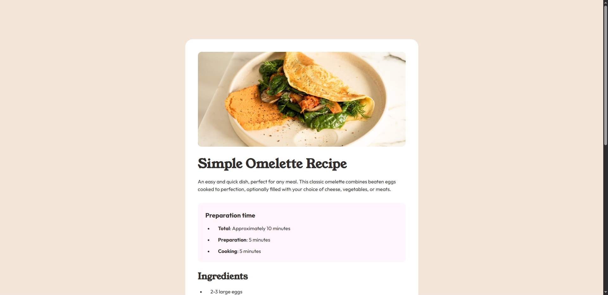

# Recipe-page

Essa é uma solução da [Recipe Page Challenge](https://www.frontendmentor.io/challenges/recipe-page-KiTsR8QQKm). O objetivo principal era replicar uma página de conteúdo grande com rolamento, mesmo com a limitação de não possuir o figma do projeto original.

## Tabela de Conteúdo

- [Overview](#overview)
  - [Screenshot](#screenshot)
  - [Link](#link)
- [Meu processo](#meu-processo)
  - [Construído com](#construído-com)
  - [O que aprendi](#o-que-aprendi)
- [Criado por](#criado-por)

## Overview

### Screenshot

### Link

- Site para consulta ao vivo: [Clique aqui](https://isaonline.github.io/Recipe-page/)

---

## Meu processo

### Construído com

- HTML5
- CSS
- Flexbox
- Variáveis
- Figma

### O que aprendi

Reconheço que foi o projeto mais difícil de replicar, o que me fez exercitar muito meus olhos e tentar o máximo de soluções possíveis, apesar de não ter alcançado 100% de fidelidade, considero um grande sucesso.
Aprendi principalmente a lidar com mais flexibilidade com tabelas e listas, personalizar suas estruturas mais livremente e resolver problemas em geral.

### Criado por

- LinkedIn - [Isabelle Nascimento](https://www.linkedin.com/in/isanasc/)
- Frontend Mentor - [@isaonline](https://www.frontendmentor.io/profile/isaonline)